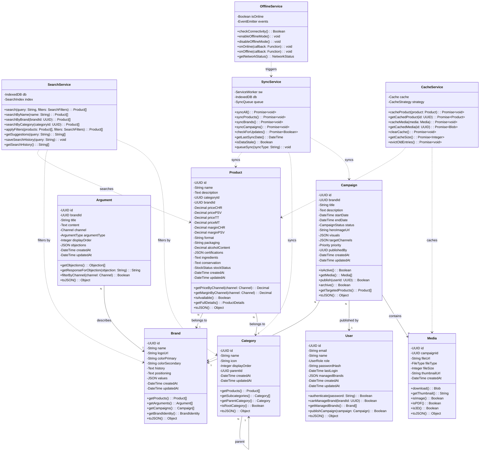
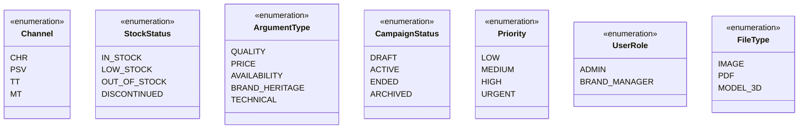
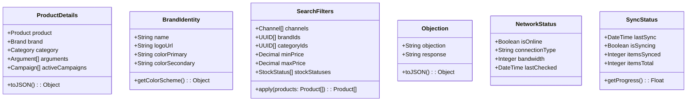

# Diagramme de Classes UML - Lions' Book

**Date:** 2026-01-29  
**Author:** Jay  
**Type:** UML Class Diagram (Mermaid)

---

## Vue d'Ensemble

Ce diagramme représente les classes principales de l'application Lions' Book avec leurs attributs, méthodes et relations.

---

## Diagramme de Classes



---

## Enums et Types



---

## Classes de Valeur (Value Objects)



---

## Notes d'Implémentation

### **Patterns Utilisés**

1. **Repository Pattern**
   - `ProductRepository`, `BrandRepository`, `CampaignRepository`
   - Abstraction de la couche de données (YAML vs DB)

2. **Service Layer**
   - `SearchService`, `SyncService`, `CacheService`, `OfflineService`
   - Logique métier centralisée

3. **Value Objects**
   - `ProductDetails`, `BrandIdentity`, `SearchFilters`
   - Objets immuables sans identité

4. **Strategy Pattern**
   - `CacheStrategy` (CacheFirst, NetworkFirst, StaleWhileRevalidate)
   - Différentes stratégies de cache selon le type de contenu

### **Principes SOLID**

- ✅ **Single Responsibility** : Chaque classe a une responsabilité unique
- ✅ **Open/Closed** : Extensions via interfaces (ex: CacheStrategy)
- ✅ **Liskov Substitution** : Hiérarchie Category respecte le principe
- ✅ **Interface Segregation** : Services avec interfaces spécifiques
- ✅ **Dependency Inversion** : Services dépendent d'abstractions

### **Gestion Offline-First**

```typescript
// Exemple d'utilisation
class ProductService {
  constructor(
    private cacheService: CacheService,
    private syncService: SyncService,
    private offlineService: OfflineService
  ) {}

  async getProduct(id: UUID): Promise<Product> {
    // 1. Essayer le cache d'abord
    const cached = await this.cacheService.getCachedProduct(id);
    if (cached) return cached;

    // 2. Si online, fetch depuis le serveur
    if (this.offlineService.checkConnectivity()) {
      const product = await this.fetchFromServer(id);
      await this.cacheService.cacheProduct(product);
      return product;
    }

    // 3. Si offline, retourner erreur ou fallback
    throw new OfflineError('Product not available offline');
  }
}
```

---

## Relations Clés

| Relation | Type | Cardinalité | Description |
|----------|------|-------------|-------------|
| Product → Brand | Association | N:1 | Chaque produit appartient à une marque |
| Product → Category | Association | N:1 | Chaque produit appartient à une catégorie |
| Argument → Brand | Association | N:1 | Arguments organisés par marque |
| Campaign → Brand | Association | N:1 | Campagnes liées à une marque |
| Campaign → User | Association | N:1 | Campagnes publiées par un brand manager |
| Campaign → Media | Composition | 1:N | Campagne contient plusieurs médias |
| Category → Category | Association | N:1 | Hiérarchie de catégories (parent/enfant) |

---

## Méthodes Critiques

### **Product**
- `getPriceByChannel(channel)` : Retourne le prix selon le canal de distribution
- `getMarginByChannel(channel)` : Retourne la marge selon le canal
- `isAvailable()` : Vérifie la disponibilité en stock

### **SearchService**
- `search(query, filters)` : Recherche multi-critères < 5 secondes
- `getSuggestions(query)` : Suggestions prédictives pendant la saisie
- `applyFilters(products, filters)` : Application des filtres avancés

### **SyncService**
- `syncAll()` : Synchronisation complète (produits, marques, campagnes)
- `checkForUpdates()` : Vérification incrémentale des mises à jour
- `isDataStale()` : Détection données anciennes (> 1 mois)

### **CacheService**
- `cacheProduct(product)` : Mise en cache d'un produit
- `getCacheSize()` : Taille du cache pour gestion stockage
- `evictOldEntries()` : Éviction des entrées anciennes (LRU)

---

## Prochaines Étapes

1. ✅ **Diagramme de Classes** - Complété
2. ⏭️ **Diagrammes de Séquence** - Recherche, Sync, Publication
3. ⏭️ **Diagramme de Composants** - Architecture frontend/backend
4. ⏭️ **Documentation API** - Endpoints REST/GraphQL
5. ⏭️ **Diagramme de Déploiement** - Infrastructure

---

**Fichier généré automatiquement - Lions' Book MVP**
