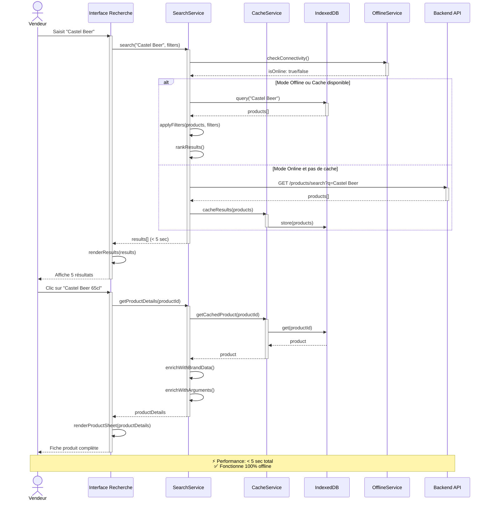
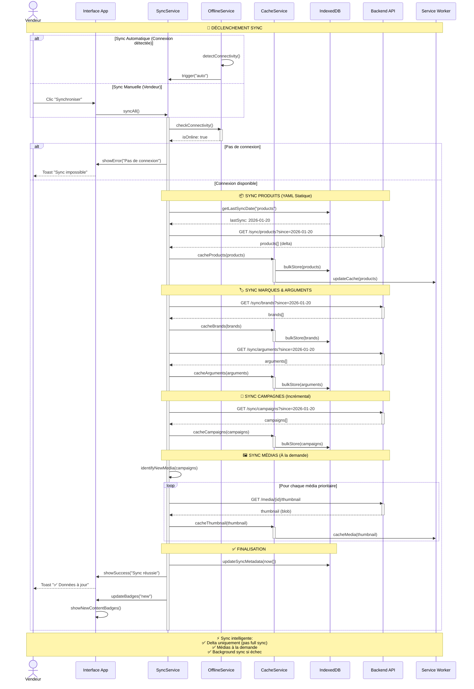
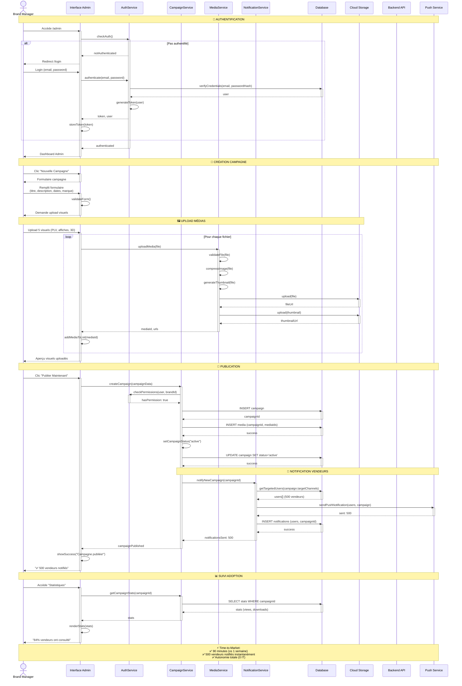
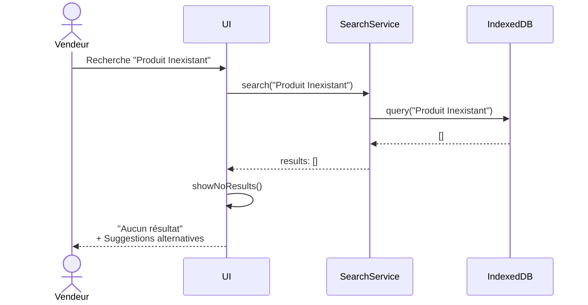
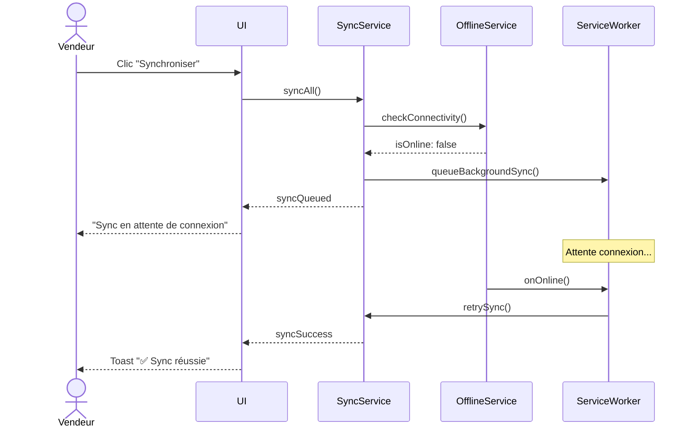
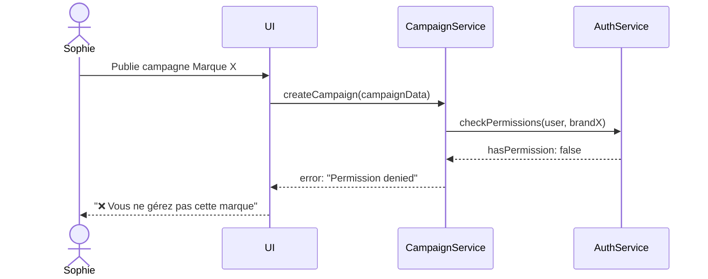

# Diagrammes de Séquence UML - Lions' Book

**Date:** 2026-01-29  
**Author:** Jay  
**Type:** UML Sequence Diagrams (Mermaid)

---

## Vue d'Ensemble

Ce document contient les diagrammes de séquence pour les 3 flux critiques de l'application Lions' Book :

1. **Recherche de Produit** - Flux de recherche instantanée < 5 secondes
2. **Synchronisation Offline** - Flux de sync automatique intelligente
3. **Publication de Campagne** - Flux de publication par Brand Manager

---

## 1. Séquence : Recherche de Produit

**Acteur :** Vendeur (Marcel, Aminata, Éric)  
**Objectif :** Trouver un produit en < 5 secondes pendant négociation client  
**Mode :** Online ou Offline

---

## 2. Séquence : Synchronisation Offline

**Acteur :** Système (automatique) ou Vendeur (manuel)  
**Objectif :** Sync intelligente des données (produits, marques, campagnes)  
**Déclencheur :** Connexion détectée, action manuelle, ou planifié

---

## 3. Séquence : Publication de Campagne

**Acteur :** Brand Manager (Sophie)  
**Objectif :** Publier une campagne promo en 90 minutes (vs 1 semaine)  
**Mode :** Online uniquement (interface admin)

---

## Scénarios d'Erreur

### **Recherche : Pas de Résultats**

### **Sync : Échec Connexion**

### **Publication : Permissions Insuffisantes**

---

## Métriques de Performance

| Flux | Métrique Cible | Mesure |
|------|---------------|--------|
| **Recherche** | < 5 secondes | P90 (90% des requêtes) |
| **Sync Complète** | < 30 secondes | Moyenne pour 500 produits |
| **Sync Incrémentale** | < 10 secondes | Moyenne pour delta |
| **Publication Campagne** | < 5 secondes | Temps serveur uniquement |
| **Upload Médias** | < 2 secondes/fichier | Pour images < 5MB |
| **Notification Push** | < 10 secondes | Pour 500 vendeurs |

---

## Notes d'Implémentation

### **Optimisations Recherche**

1. **Index Full-Text** sur IndexedDB pour recherche rapide
2. **Debouncing** de 300ms sur la saisie utilisateur
3. **Pagination** des résultats (10 par page)
4. **Cache des recherches fréquentes** (LRU cache)

### **Stratégie Sync**

1. **Sync Delta** : Uniquement les changements depuis lastSync
2. **Batch Processing** : Traitement par lots de 50 items
3. **Background Sync API** : Retry automatique si échec
4. **Compression** : Gzip pour réduire la bande passante

### **Gestion Médias**

1. **Lazy Loading** : Téléchargement à la demande
2. **Progressive JPEG** : Affichage progressif
3. **WebP Format** : Compression optimale (30% plus léger)
4. **Thumbnail First** : Afficher miniature avant full image

---

## Prochaines Étapes

1. ✅ **Diagrammes de Séquence** - Complétés (3 flux critiques)
2. ⏭️ **Diagramme de Composants** - Architecture frontend/backend
3. ⏭️ **Documentation API** - Endpoints REST détaillés
4. ⏭️ **Diagramme de Déploiement** - Infrastructure cloud

---

**Fichier généré automatiquement - Lions' Book MVP**
